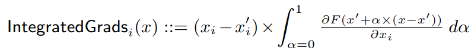
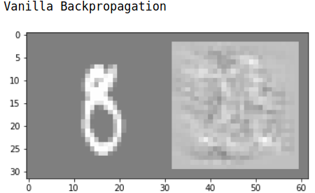
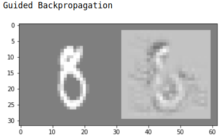
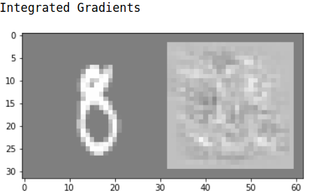
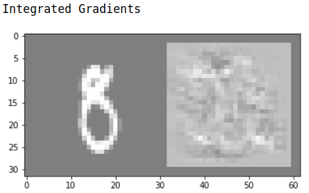
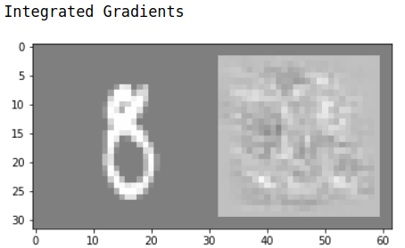

## Axiomatic Attribution for Deep Networks | [Paper](https://arxiv.org/pdf/1703.01365.pdf) | [Notes](notes_axiomatic_for_dnn.md) | [Implementation](../../implementation/6.Backpropagation.ipynb)
***
### Integrated Gradients
Consider a **straightline path** in R^n from the baseline x'(black image) to the input x. **Integrated gradients** are defined as the path integral of the gradients along the straightline path from the vaseline x' to the input x. In practice we can construct a sequence of images interpolating from a baseline to the actual input image. Compute the gradient across these images in a loop and average these gradients to get the integrated gradients map. A formal definition is as follows

  

  
  
  

Comparison on vanilla backpropagation, guided backpropagation, integrated gradients. Integrated gradient map is qualitatively similar to the vanilla backpropagation map.

  
  

Comparison on different steps. In the left one the path is divided into **2** steps while the right one is **10000** steps. The result doesn't benefit from the amount of steps much. 

### Properties of Integrated Gradient
- **Sensitivity**: If for every input and baseline that differ in one feature but have different predictions then the differing feature should be given a non-zero attribution. Vanilla backpropagation, guided backpropagation, deconvnet, LRP, DeepLift violate this rule.

- **Implementation  Invariance**: If outputs of two networks are equal for all inputs, despite having different implementation, they are functionally equivalent. DeepLift and LRP violate thie rule.  

- Conservation (Completeness): Total attributions add up to the difference between the output of network at the input and at the baseline. 

