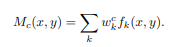
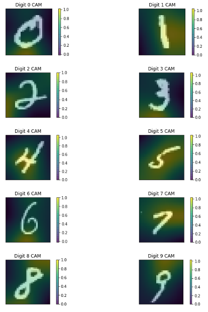

## Learning Deep Features for Discriminative Localization | [Paper](http://cnnlocalization.csail.mit.edu/Zhou_Learning_Deep_Features_CVPR_2016_paper.pdf) | [Notes](./notes_cam.md) | [Implementation](../../implementation/10.1.Class_Activation_Map.ipynb)
***
### Class Activation Maps
Class Activation Map (CAM) refers to the weighted activation maps generated for a given image. The best results for CAM are on CNNs which consist of blocks of CONV layers followed by a single AVGPOOL layer. The output from the AVGPOOL layer is then fed into a single DENSE layer which acts as a classifier.
 

  

<small><small>Formula for calculating Class Activation Maps  for a given class c.</small></small>  
CAM is computed by multiplying the activation maps from the very last CONV layer by the weights of the DENSE classification layer for the chosen class. The low-resolution map is then upsampled to the size of the input image. The input image and the generated CAM are then being shown together to showcase the parts of the image which have had the highest importance for the classified class. 
Furthermore, CAM can be used as a localization tool with promising results.

### Results

  

