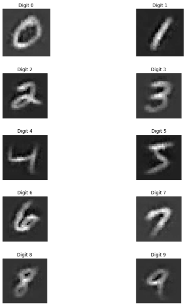

## Learning Important Features Through Propagating Activation Differences
 | [Paper](https://arxiv.org/pdf/1704.02685.pdf) | [Videos](https://www.youtube.com/watch?v=v8cxYjNZAXc&list=PLJLjQOkqSRTP3cLB2cOOi_bQFw6KPGKML) | [Notes](./notes_deeplift.md) | [Implementation](../../implementation/9.DeepLIFT.ipynb)
***
### I. DeepLIFT
DeepLIFT (Deep Learning Important FeaTures) is a method which aims to dissect the output of a NN by backpropagating the contributions of every layer along the NN to the initial features of the input. In order to do that, DeepLIFT tries to explain the difference in neuron output from a predefined **reference neuron output** in terms of the difference of the input from a predefined **reference input**. Based on this difference, the method assigns contributions which are backpropagated all the way back to the input features.
 
Let's say we have a target neuron *t* with diff-from-ref *dt* and a layer *X* with neurons x1, x2 ... xn. The *dt* has, then, the following form.

  

    
  

We want to explain the delta output <i>dt</i> in the context of the delta input <i>dx1</i>, <i>dx2</i> and so on. To do so, we are assigning contributions <i>Cdxi-dt</i> such that the sum of all contributions <i>Cdxi-dt</i> is equal to the delta output <i>dt</i>.

  

    
  

The *reference* values are the values which are being generated by a predefined *reference input*, the choice of which requires a specific domain knowledge. For MNIST, a suitable reference input would be a completely black image.  

A **multiplier** *Mdxdt* is defined as the contribution *Cdx-dt* over the delta input *dx*. Multipliers satisfy the chain rule and thus, support backpropagration.

  

    
  

In order to allow for a different handling of positive and negative contributions, the *dy* could be seperated in its positive and negative components. Some of the defined DeepLIFT rules make use of this distinction, while others don't.

  

    
  

### II. DeepLIFT Rules

DeepLIFT defines a few rules for assigning contributions scores. The **Linear rule** applies to DENSE and CONV layers. The **Rescale rule** applies to non-linearieties such as ReLU, Tanh, Sigmoid and so on and treats positive and negative contributions equally. The **RevealCancel rule** handles non-linearities, as well, but unlike the Rescale rule gives different treatment to positive and negative contributions. 

#### 1.1. Rescale rule
For the **Rescale** rule, we set *dy(+|-)* proportional to *dx(+|-)* in the following manner:

  

    
  

The multipliers have as a consequence the following form:

  

    
  

In the places, where the values are close to their reference counterparts, numerical instability can be observed due to division by either 0 or extremely small value. In these cases, the gradient instead of the multiplier can be used. 

#### 1.2. Rescale Results

  

    
  

#### 2.1. Linear rule
The **Linear** rule is used for Linear and CONV layers. The contributions are computed in the following manner.
More detailed formulas can be found in this appendix: http://proceedings.mlr.press/v70/shrikumar17a/shrikumar17a-supp.pdf

  

    
  

#### 2.2. Linear Results

  

    
  

#### 3.1. RevealCancel rule
The **RevealCancel** rule also targets ReLU layers, but unlike the **Rescale** rule it handles the positive and negative contributions in different ways. Here we compute the contributions as follows: 

  

    
  

In short, for the positive output contributions we are trying to figure out the average impact of the positive delta input after no terms has been added and after the negative delta input has been added. The same operation is done for the negative output contributions, but in this case, we compute the impact of the negative delta input without any added terms and after the positive delta input have been added.

#### 3.2. RevealCancel Results

  

    
  

