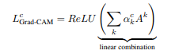
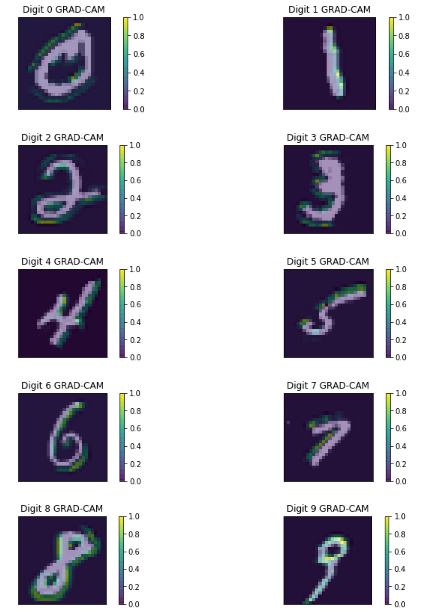
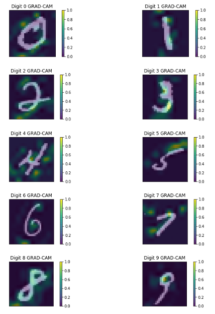
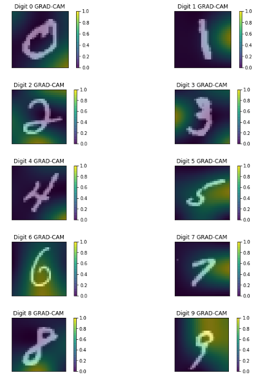

## Grad-CAM: Visual Explanations from Deep Networks via Gradient-based Localization | [Paper](https://arxiv.org/pdf/1610.02391.pdf) | [Notes](./notes_grad_cam.md) | [Implementation](../../implementation/10.2.Grad_Class_Activation_Map.ipynb)
***
### Gradient-Weighted Class Activation Maps
Gradient-Weighted Class Activation Maps (Grad-CAM) is a generalization of the CAM method, which uses the gradient signal instead of the weights of the last layer for weighing the activations. This makes the method reusable for any kind of CNN models unlike the original CAM method. Furthermore, Grad-CAM can be applied to practically any layer of the CNN model which produces a meaningful gradient signal. 
 

  

<small><small>Formula for calculating Grad-CAM  for a given class c.</small></small>  
Grad-CAM is being computed by multiplying the activations from the forward pass of the chosen layers with global-averaged-pooled incoming gradient from the backward pass. The result of the multiplication is then run through a ReLU activation. The final result is upsampled to the dimensions of the original input. 
Similarly to CAM, Grad-CAM can be used as a localization tool with promising results. Unlike CAM, Grad-CAM provides good results for wide variety of CNN model-families, without the need for architectural changes or auxiliary training.

### Results for first CONV layer

  

### Results for first CONV layer

  

### Results for third and final CONV layer

  

