## Inceptionism: Going Deeper into Neural Networks  | [Paper](https://ai.googleblog.com/2015/06/inceptionism-going-deeper-into-neural.html) | [Notes](notes_inceptionism.md) | [Implementation](../../implementation/2.Deep_Dream.ipynb)
***
### DeepDream
Neural networks that we trained to discriminate between different kinds of images have a bit of information needed to generate images. One way is the AM that we start at a random noise and tweak the image until the network considers it as a certain class.
Deep dream is a method to **over interpret** features of a image. We feed the network an arbitrary image and instead of prescribing which feature we want to amplify we let the network analyze the image itself. After **choosing which layer and which filter** we ask the network to enhance whatever it detected.

For implementation we downsample the image to different scale and blend the DeepDream effects to make the final image looks clearer. Otherwise the DeepDream effect will remain in a low resolution and looks like noise. 

### DeepDream Results

  
  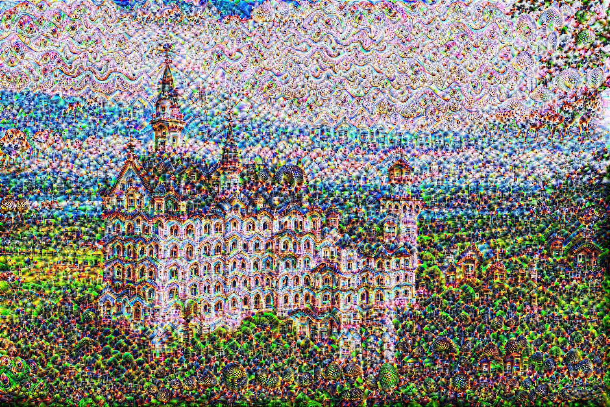
  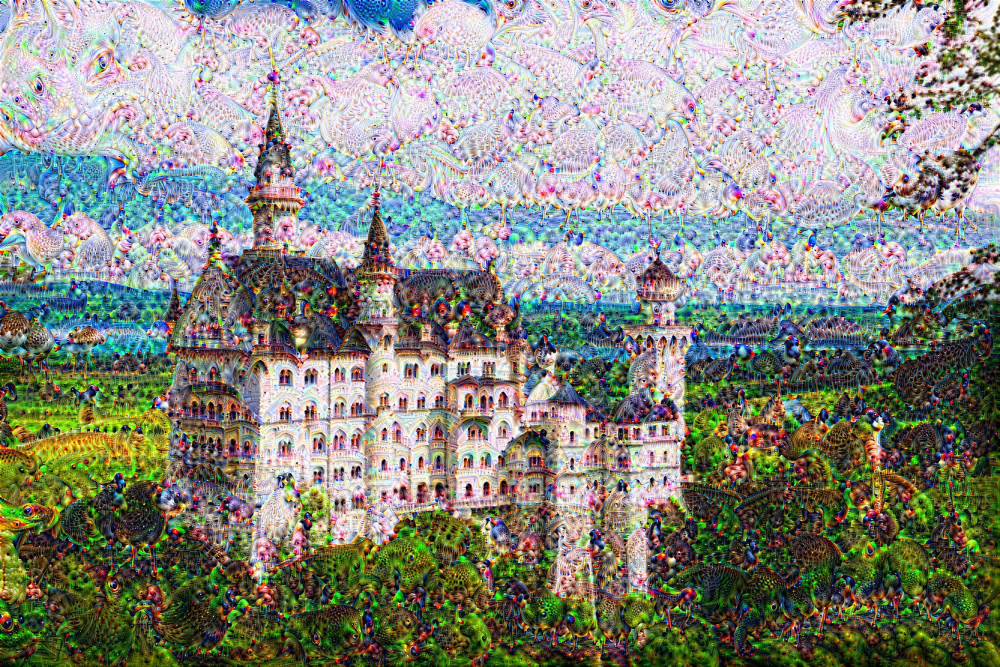

DeepDream on 25th layer and 27th layer

  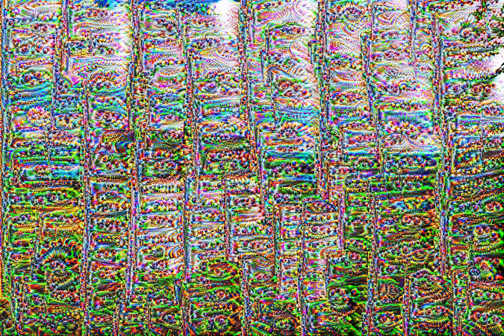
  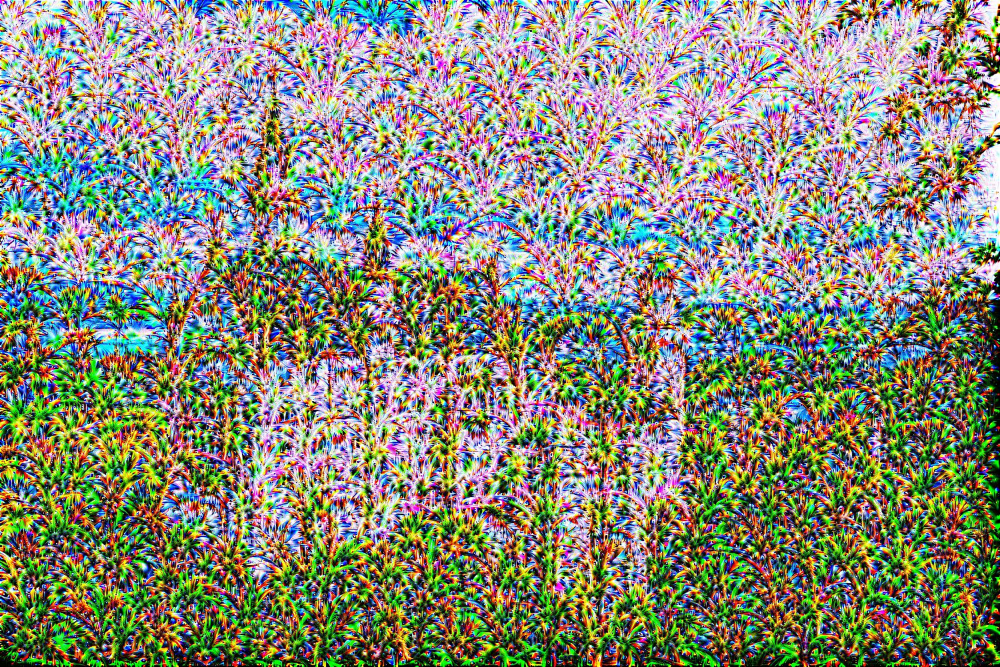
  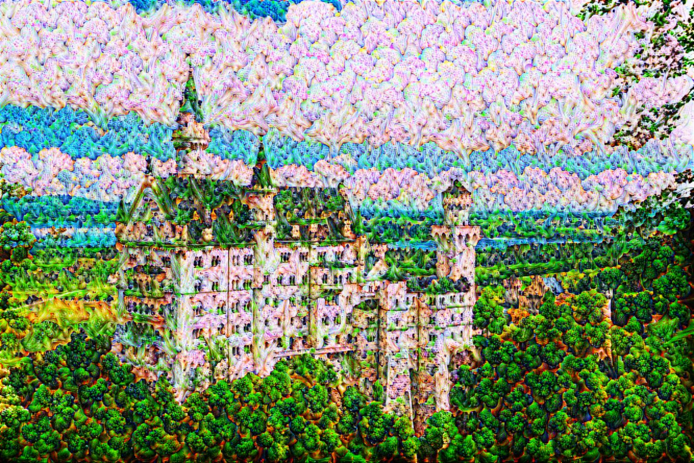

DeepDream on 25th layer with different channels (channel No.30 and channel No.150)

  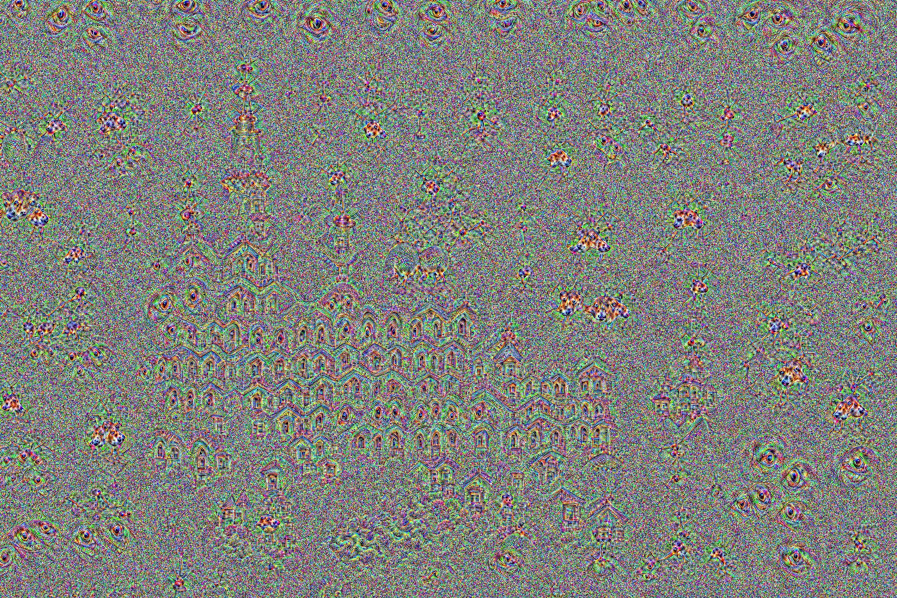

DeepDream adding random noise

### Improvements of DeepDream Results

After adding random rolling feature and split the image into tiles, we can upsample the image without memory problem to calculate gradients. The DeepDream is now scalable. We also use the idea of SmoothGrad to add some Gaussian noise on every different scale so that the noise will be further suppressed.

  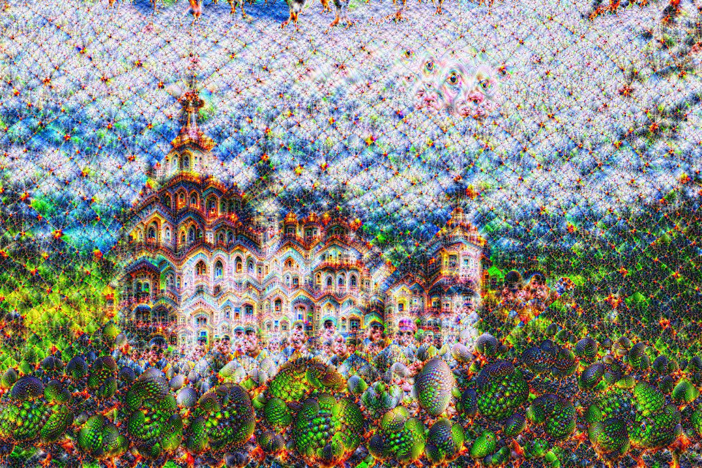
  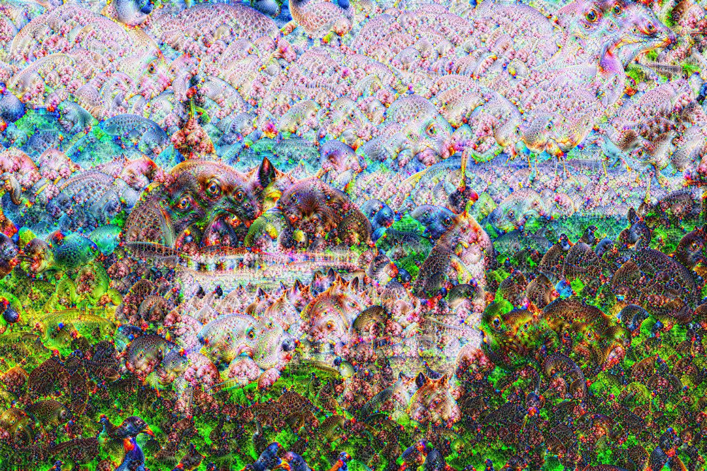
  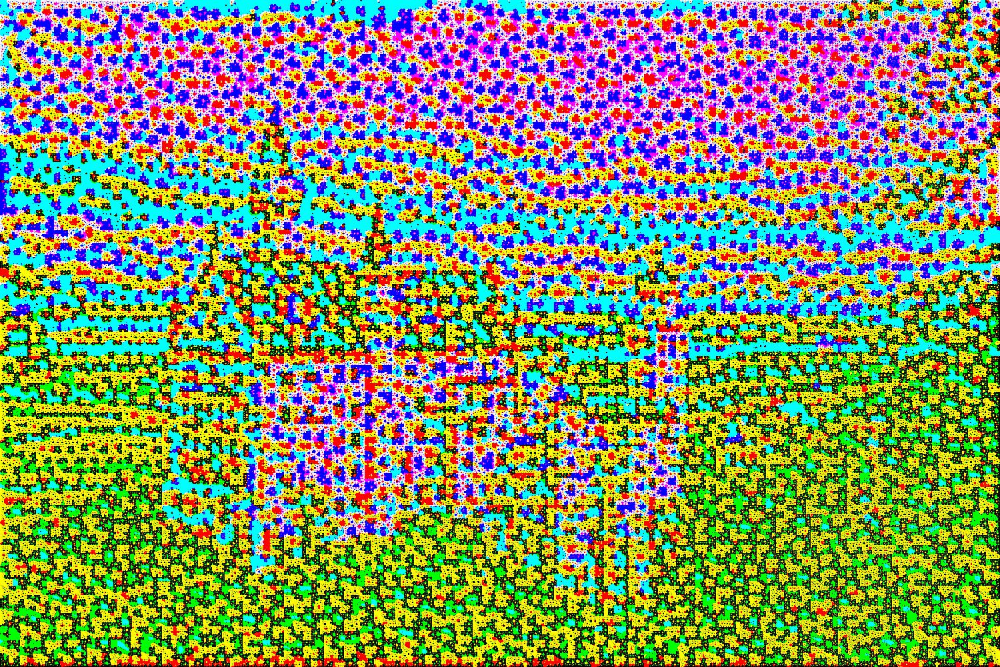

DeepDream on 25th layer, 27th layer, and 2nd layer. Note that DeepDream only visualize dream-like hallucinogenic apperance well on higher layers. 

  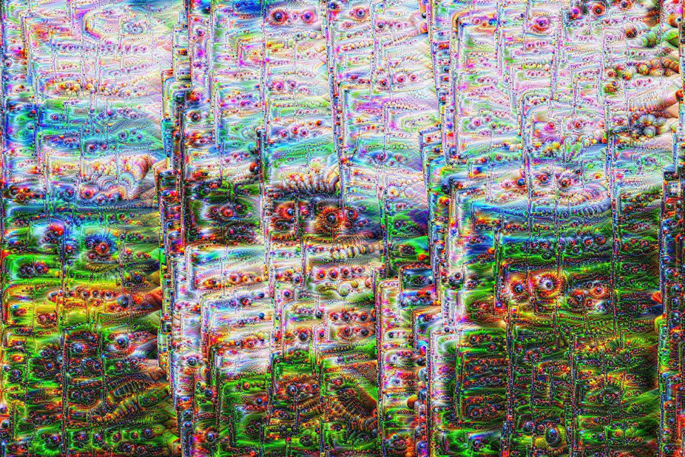
  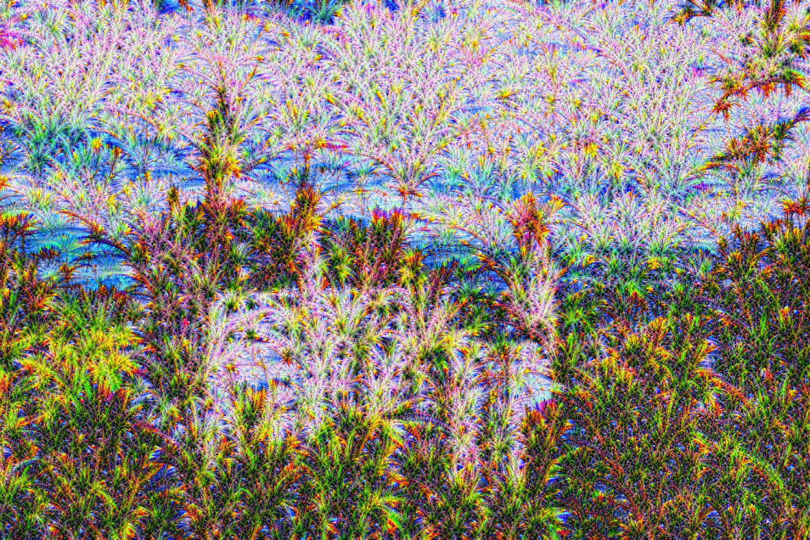
  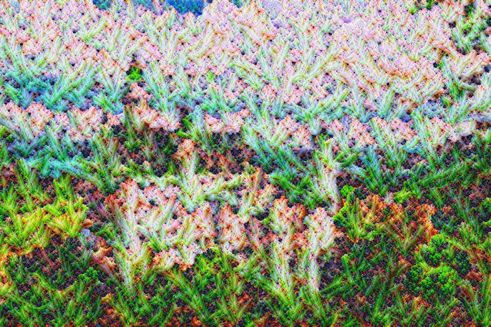

DeepDream on 25th layer with different channels (channel No.30 and channel No.150). If the objective is a channel rather than the whole layer, visualized patterns will be much stronger and surpass edges of the original image.  
