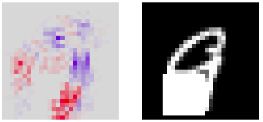
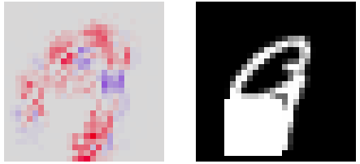
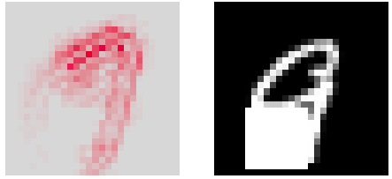
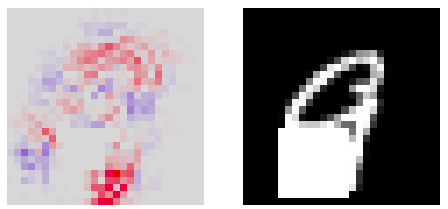
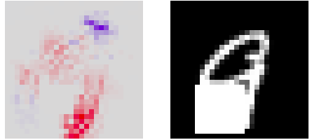
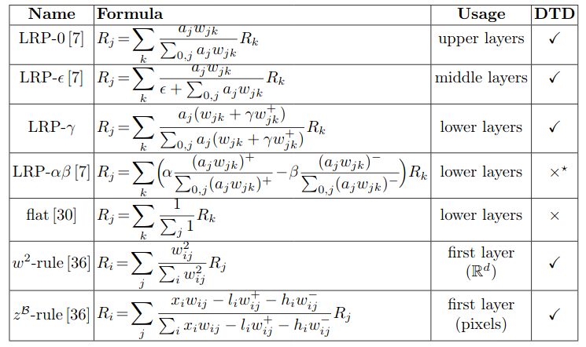

## Layer-Wise Relevance Propagation: An Overview | [Paper](http://iphome.hhi.de/samek/pdf/MonXAI19.pdf) | [Notes](notes_lrp_overview.md) | [Implementation](../../implementation/8.1.LRP.ipynb)
***
### Comparison of different LRP rules
 - **LRP-0**: The basic rule of LRP. However, it can be shown that a uniform application of this rule to the whole neural network provides an explanation that is equivalent to **Gradient×Input**. The result heatmap seems noisy, therefore one needs to design more robust propagation rules.

 - **LRP-epsilon** This enhancement of LRP is from adding a small positive term in the denominator. Epsilon is to absorb some relevance when the contributions to the activation of neuron is to weak or are weak or contradictory. Bigger epsilon leads to a **sparser heatmap** and **less noisy**.
 
 - **LRP-gamma**: By favoring the effect of **positive contributions** over negative contributions we obtain this rule. As gamma increases, negative contributions start to disappear. The prevalence of positive contributions can limit how much positive and negative relevance can grow in LRP backpropagation, which leads to a more interpretable manner. Note when gamma is close to infinity large, LRP-gamma is equivalent to **LRP-a1b0**.

The following is a MNIST image nine but due to the white patch **predicted as 0** by our network.

  
  

Results from unifrom LRP-0(left) and uniform LRP-epsilon(right). 

  
  

Results from uniform LRP-a1b0(left) and uniform LRP-a2b1(right) . For LRP-a1b0(left) it only indicates which features influence our network the most, but doesn't show negative relevance scores. 

### Which rule to choose?

Uniform LRP-0 heatmap is often overly complex and does not focus on salient features. The explanation is neither faithful nor understandable. Uniform LRP-epsilon heatmap keeps only a limited number features. It's a faithful explanation, but sometimes too sparse to be understanable. Uniform LRP-gamma (LRPa1b0) heatmap produce features that are more densely highlighted, but it also picks unrelated concepts and concepts that produce negative relevance, making it **unfaithful**.

A suggestion from this paper is pick a composite LRP where we use the **upper layers for LRP-0**, **middle layers for LRP-epsilon**, and **lower layers for LRP-gamma(LRP-a1b0)**.

  

Results from Composite LRP

  

