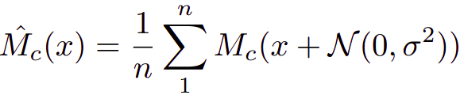
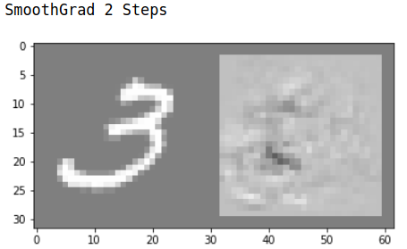
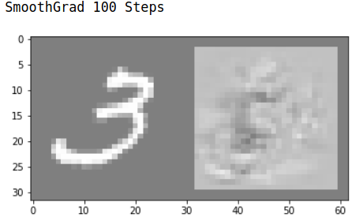
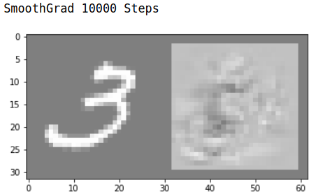
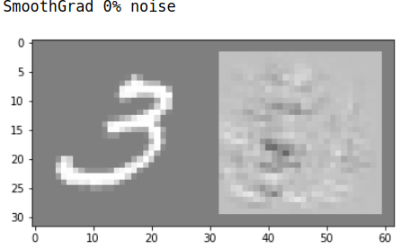
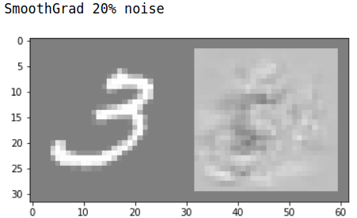
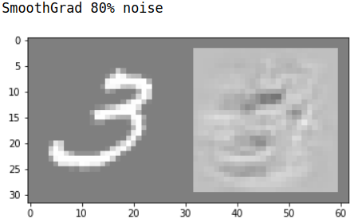
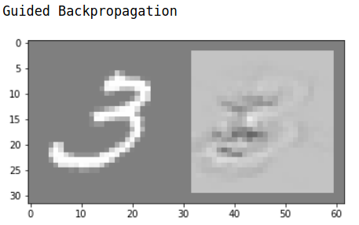
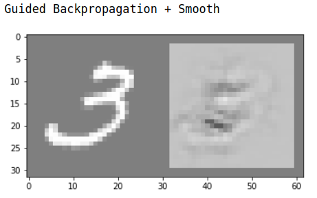

## SmoothGrad: removing noise by adding noise | [Paper](https://arxiv.org/pdf/1706.03825.pdf) | [Notes](notes_smothgrad.md) | [Implementation](../../implementation/6.Backpropagation.ipynb)
***
### SmoothGrad
**SmoothGrad** can sharpen gradient-based sensitivity maps. The sensitivity maps based on raw gradients (vanilla backpropagation) are visually noisy. An explanation for the noise is that the derivative of the function may fluctuate sharply at small scales. In other words, due to the non-smooth derivative of the function (e.g. discontinuities caused by ReLU) there are many meaningless local variations which appear as noise in sensitivity maps. Because the local fluctuations are meaningless, we compute a **local average** of gradient values with a **Gaussian kernel** to smooth the derivative of the function.

  

Formula for SmoothGrad in a stochastic approximation in practice, Mc is the derivative of the function with respect to the image added Gaussian noise

  
  
  

**Sample size n**: Estimated gradient becomes smoother as n increases. However, there was little apparent change in the visualizations for n > 50.

  
  
  

**Standard deviation of Gaussian noise**: In the paper it is suggested that 10%-20% noise can sharpen the sensitivity map while still maintain the structure of the original image. 0% noise is equal to **vanilla backpropagation** 

  
  

Combining SmoothGrad with guided backpropagation

SmoothGrad has the highest impact when the object is surrounded with **uniform background color**. This implies noise may have a differential effect on the sensitivity to different textures. SmoothGrad qualitatively shows better **discriminativity** over the other gradient-based methods, on the contrary guided backpropagation shows the weakest discriminativity. 
### Techniques for Visualization

 - Absolute value of gradients: When the object of interest has the **same color across the classes** (MNIST), it is recommended not to convert to absolute values. The positive gradients indicate positive signal to the class. On the other hand, for ImageNet dataset (Maybe also CIFAR) taking the absolute value of the gradient produced clearer pictures, because the direction is **context dependent**.
 - Capping outlying values: The presence of few pixels that have much higher gradients than the average, which is utilized in generating adversarial examples. 
 - Multiplying maps with the input images: Make sense when we view the importance of the feature as their contribution(weights) to the total score. However for **black pixels** it will never show up on the sensitivity map.

