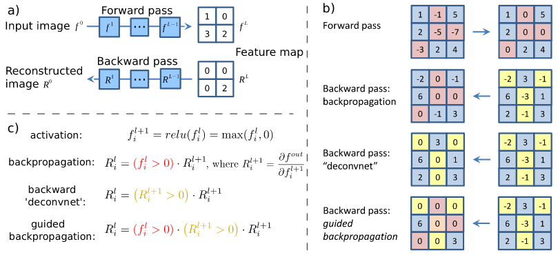
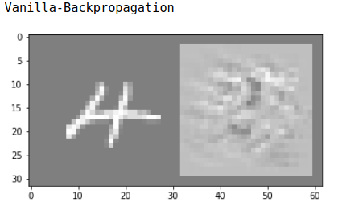
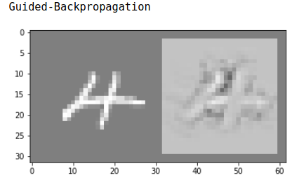
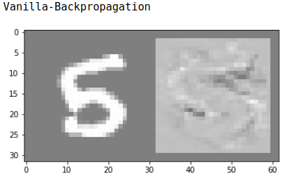
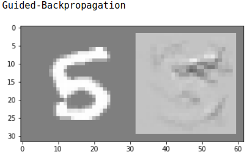

## Striving for Simplicity: The All Convolutional Net | [Paper](https://arxiv.org/pdf/1412.6806.pdf) | [Notes](notes_striving_for_simplicity.md) | [Implementation](../../implementation/6.Backpropagation.ipynb)
***
### Guided Backpropagation
Deconvnet doesn't work well without max-pooling layers. To visualize the concepts 
learned by a network without pooling layers, the author proposes the method guided 
backpropagation. During backward pass, guided backpropagation handles **gradient from ReLU** 
in a combination of deconvnet and vanilla backpropagation. Gradients will be masked 
out when either corresponding entries of **(1) the top gradient (deconvnet)** or 
**(2) bottom data (vanilla backpropagation)** is **negative**. This prevents backward 
flow of negative gradients, corresponding to the neurons which decrease the 
activation of the higher layer unit we aim to visualize.

  

Different ways about how vanilla backpropagation, deconvent, and guided backpropagation handle ReLU nonlinearity in backward pass.

  
  

  
  

Comparison on vanilla backpropagation and guided backpropagation

### Discussion on Deconvnet
The pooling layers in the deconvnet help the network to compute switches 
(positions of maxima within each pooling region). Using these switches in the deconvent 
backward pass makes it conditioned on an input image and the network doesn't directly 
visualize learned features. On the other hand, if the network doesn't contain pooling 
layers, the deconvnet isn't conditioned on an input image. This way we get insights into 
learned features in lower layers. However, the network fails to visualize recognizable  
feature maps for higher layers, because higher layers learn more invariant representations, 
and there is no single image maximally activating those neurons. Hence to get reasonable 
reconstructions for higher layers it is necessary to condition on an input image. Gradient based
method is an alternative way that is conditioned on an image through activation functions (ReLU).  

### Q's
- What does the term "invariant representation" mean in page 8?

