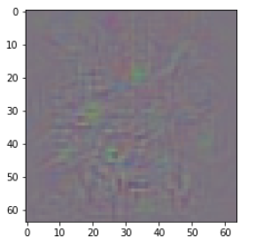

## On Calibration of Modern Neural Networks
 | [Paper](http://proceedings.mlr.press/v70/guo17a/guo17a.pdf) | [Notes](./notes_temperature_scaling.md) | [Implementation](../../implementation/13.Uncertainty_Aware_DeepLIFT.ipynb)
***
### I. Paper summary
#### 1. Calibrated Neural Networks
Due to recent advancements in NN and their ever-increasing use in different applications the need for a reliability of machine learning models has risen. Despite the huge improvements of the accuracy of NN in the recent years machine learning models have been becoming more and more miscalibrated. A perfectly calibrated confidence estimate should be equal to the true probability. For example, given that the confidence estimate for each out of n predictions is .8 fo, we would expect to correctly classify 80% of the n samples. Mathematically, this can be expressed in the following manner:

  

    
  

In order to visualize the degree of calibration of neural networks reliability diagrams can be utilized. Expected Calibration Error (ECE) and Maximum Calibration Error (MCE) are numerical estimates of the calibration degree of a model, which utilize the difference between the confidence estimates and the actual probabilities.

  

    
    
  

  

  Left: ECE. Right: MCE
  

#### 2. Reasons behind the miscalibrated NN
The methods displayed in the last section can be used to quantify and visualize the calibration degree of models and thus, find which techniques positively or negatively impact the calibration of the models. The authors argue that both increasing model capacity and batch normalization have a negative impact on models. Despite the popularity of these techniques they make the models "overconfident" which leads to miscalibration. Increasing the weight decay does increase the calibration degree of NN and as such is beneficial from a calibration point of view. Unfortunately, higher degrees of weight decay have proven to lead to poor classification performance of NN and because of that, are rarely used in practice.

#### 3. Calibration methods
In order to increase the calibration degree of models different methods can be utilized.  
The paper discusess the three binning calibration methods <b>Histogram binning</b>, <b>Isotonic regression</b>, <b>Bayesian Binning into Quantiles</b>. The <b>Histogram binning</b> is a non-parametric method, which divides the confidence estimates into M bins to each a calibrated probability Qm is assigned. Whenever a confidence estimate falls into the ith bin the Qi calibrated probability is returned. The <b>Isotonic regression</b> method is another non-parametric method, which utilizes the same strategy, but instead learns a constant function F which transforms confidence estimates into calibrated probabilities. <b>Bayesian Binning into Quantilies (BBQ)</b> is an extension of the histogram binning utilizing Bayesian model averaging.
 
In addition to the binning methods, <b>Platt scaling</b> is discussed. <b>Platt scaling</b> learns parameters W and b which are used to compute the calibrated probability. A special case of <b>Platt scaling</b> is <b>Temperature scaling</b> which learns a single scalar value T used to calculate the calibrated probabilites.

  

    
    
  

  

  Left: Platt scaling. Right: Temperature Scaling
  

 
The results outlined by the authors showcase that temperature scaling have the most positive influence on the calibration degree of machine learning models despite it's simplicity from both theoretical and implementation standpoints.

### II. Results
#### 1. Results for MNIST Model

  

    
    
  

  

  <b>Left:</b> DeepLIFT LinearRevealCancel <b>Right:</b> DeepLIFT LinearRevealCancel with Temperature Scaling
  

  

#### 2. Results for ImageNet Model

  

    
    
  

  

    
    
  

  

  <b>Top Left:</b> Base image <b>Top Right:</b> Vanilla Backprop
  

  

  <b>Down Left:</b> DeepLIFT LinearRevealCancel <b>Down Right:</b> DeepLIFT LinearRevealCancel with Temperature Scaling
  

