## Visualizing and understanding convolutional networks | [Paper](https://arxiv.org/pdf/1311.2901.pdf) | [Notes](notes_visualize_&_understand.md) | [Implementation](../../implementation/4.Deconvolution.ipynb) | [Implementation II](../../implementation/5.Occlusion_Sensitivity.ipynb)
***
### DeConvNet
A deconvolutional network can be thought as a reverse CNN, in which features are being mapped back into the image space. The network has an architecture which is a mirror image of the original model with the main components (e.g.  pooling, convolutions, non-linearities) reversed. **Max Pooling** can be partially reverted, if the indices from the original CNN are saved and loaded in the **DeConvNet**. **Filtering** is reversed by reusing a transposed version of the learned weights of the original model. If we want to showcase a single activation, we need to set all other filters from the same layer to zero in order to examine the importance of the chosen filter.\
**DeConvNet** can be used for unsupervised learning, as well.

  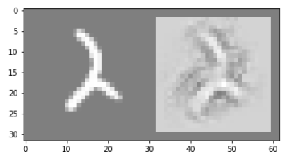
  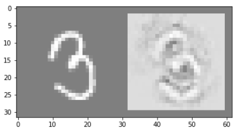
  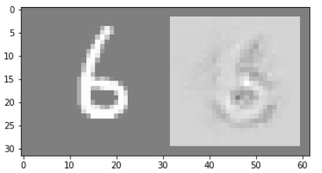 

<small><small>Results: The results from the <b>DeConvNet</b> model for the numbers 2, 3 and 6 by using all feature maps.</small></small>

  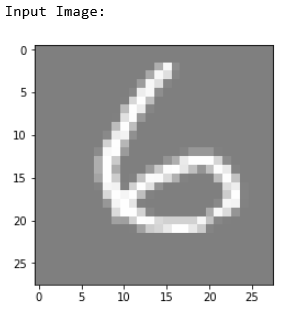
  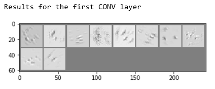
  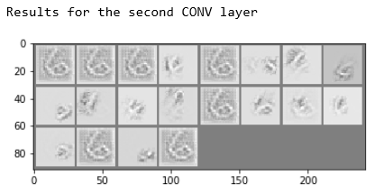 

<small><small>Results: Input and feature maps activations for each filter for the two CONV layers in the model.</small></small>

***
### Occlusion Sensitivity
**Occlusion Sensitivity** refers to the technique of monitoring the output of a classifier by hidding parts of the original image. Based on that, the regions of the image can be found, which have the highest importance to the final decision of the model. An example for a picture of the number 3 can be seen. The experiment shows that hiding the central regions of the image leads to plummeting of the probability assigned to the correct class. Based on that, the conclusion can be made, that the classifier correctly locates the position of the object.

  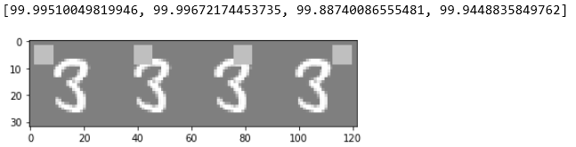
  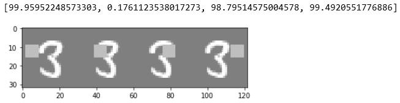
  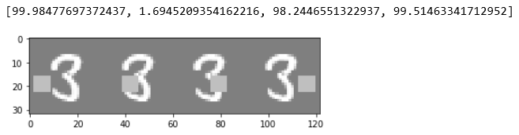 
  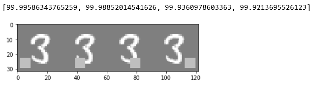 

<small><small>Results: <b>Occlusion Sensitivity</b> - Numbers above pictures are the probabilities which the trained model assigns for each image for class 3.</small></small>

***
### Feature Evolution during Training
Another possibility to visualize the features that a model learns is by incrementally showcasing them during the training phase. This is achieved by using the learned weights to compute the feature maps activations for a chosen base image after each epochs. Results with these technique can be observed below.

  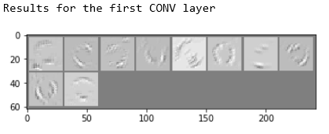
  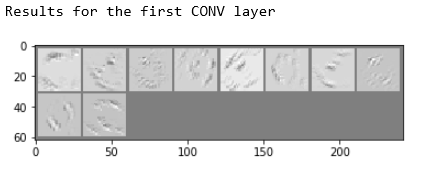

  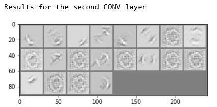
  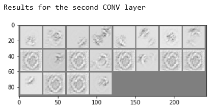

<small><small>Results: Comparison between feature activations in DeConvNet right after first and fifth epoch of training for a base image. On the left side, the results after the first epochs are depicted. The right side corresponds to the state of the model after the fifth epoch.</small></small>