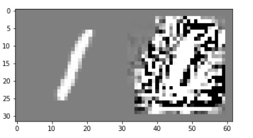
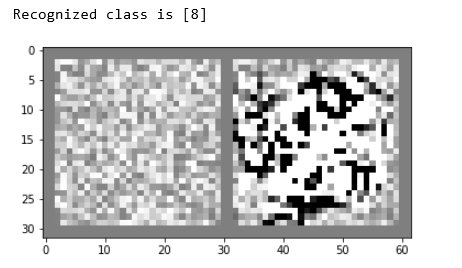
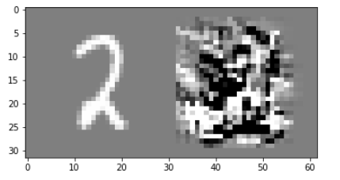
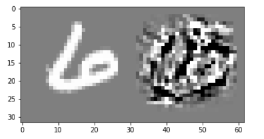
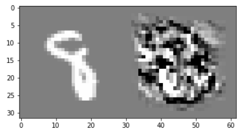

## Deep Inside Convolutional Networks: Visualising Image Classification Models and Saliency Maps
 | [Paper](https://arxiv.org/pdf/1312.6034.pdf) | [Notes](./notes_visualizing_models.md) | [Implementation](../../implementation/3.Saliency_Maps.ipynb)
***
### Class Model Visualization
We start from an initial image and try to find the image that would lead to the highest possible score for the chosen class.
To do so, we try to maximize: **L(wc, x) = logp(wc|x) - lambda * ||x||** w.r.t. to the image x. *Wc* corresponds to the chosen class for which we want to find the prototype. The weights of the model are, in this case, fixed and we use backprop to calculate the gradient of the function w.r.t. to the input image x and iteratively update x.
**The update rule equals x = x + alpha * df(x) / dx**
**Possible starting points:**
 - Random noise
 - Zero image and then add the training set mean image
 - Random image from the training set

  
   

<small><small>Results: Left picture is generated by starting with a random image from the dataset. The second image we start with random noise and try to generate a sample for class 8.</small></small>

***
### Image-Specific Class Saliency Visualization
Here, we try to explain a classification decision for a given image by highlighting the pixels of the image which had the biggest impact on the output of the DNN.
To do so, we run the forward pass of the DNN and use backprop to calculate the gradient w.r.t the input image starting from the classified class  f(wc|x) /x. The calculated gradient is then visualized. Furthermore, the saliency maps can be used for object localization directly without the need for any further training. Here, we regard data points with a value beyond a certain threshold as the recognized object and the remaining pixels as the background.

  
  
   

<small><small>Results: Saliency maps for three randomly selected images from the dataset.</small></small>

***
### Relation to Deconvolutional Networks
There is an intrinsic correlation between DeConvNet and the gradient-based visualization. The calculation of the gradient of popular layers like CONV, MAXPOOL and activations like ReLU and their DeConvNet counterparts follow the same approach and ultimately lead to very similar results. Based on this, the gradient-based approach can be seen as a generalization of the DeConvNet, since it can be used with many more layers than its counterpart.
***
### Q's:
***

